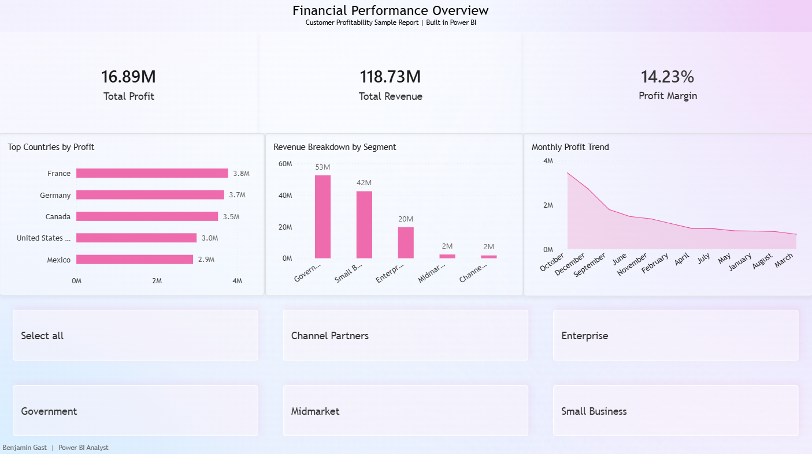
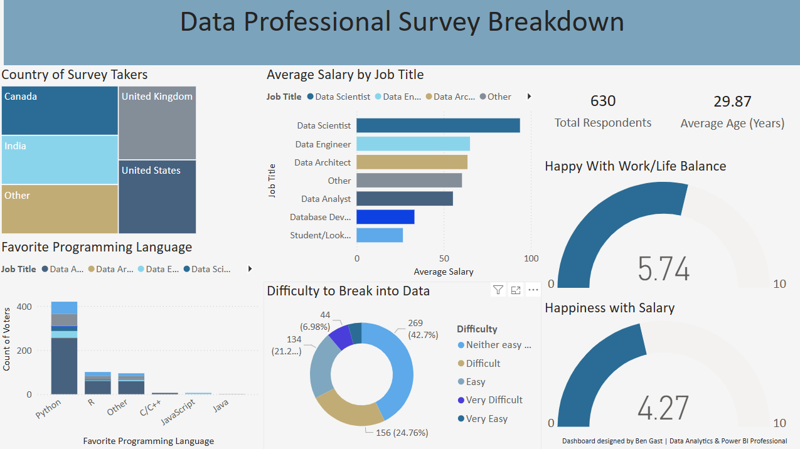

<link rel="stylesheet" href="assets/css/style.css">

  <a href="https://benjamingast777.github.io">Home</a> |
  <a href="https://benjamingast777.github.io/projects">Projects</a> |
  <a href="https://benjamingast777.github.io/about">About</a> |
  <a href="https://benjamingast777.github.io/contact">Contact</a> |
  <a href="https://benjamingast777.github.io/resume">Resume</a>

# Hi, I'm Ben Gast

Business Intelligence and Finance Student | Ohio University  

I’m passionate about transforming data into insight. My interests lie at the intersection of **business intelligence, finance, and analytics**, where I can connect technical data modeling with strategic business impact.  
Through experience in IT infrastructure, technology risk consulting, and data visualization, I’ve developed a strong foundation for roles in **data analytics, BI consulting, and financial systems analysis**.  

---

## Resume

  

---

## Featured Projects

### Power BI Dashboard – Financial Performance Overview

This project analyzes company profitability and revenue performance through an interactive Power BI dashboard.  
It visualizes key financial indicators such as total profit, total revenue, and profit margin while breaking results down by region and customer segment.  

The goal of the project was to create a clear, professional layout that allows business leaders to evaluate performance quickly and identify areas for growth.  
The dashboard also includes filters for business segments like Enterprise, Midmarket, and Small Business, allowing users to isolate patterns and trends that matter to their line of business.  

Tools used: Power BI, DAX, Power Query, Excel  

---

### Power BI Dashboard – Data Professional Survey Breakdown

This dashboard examines survey results from over 600 data professionals to uncover trends in salary, job satisfaction, and industry demographics.  
It compares roles such as Data Analyst, Engineer, and Scientist while visualizing differences in pay, preferred programming languages, and work-life balance.  

The project demonstrates the use of multiple visualization types, calculated measures, and color consistency to build a complete, easy-to-read analytics report.  
It serves as a great example of how survey data can be used to extract practical insights about the workforce and data industry as a whole.  

Tools used: Power BI, DAX, Excel  

---

[About](https://benjamingast777.github.io/about) | [Contact](https://benjamingast777.github.io/contact) | [Resume](https://benjamingast777.github.io/resume)
